# 🤖 Cambot AI - Multi-Department RAG Chatbot


TechCorp AI is an **advanced RAG (Retrieval-Augmented Generation) Chatbot** designed for enterprise environments. It features a "Router & Expert" architecture that intelligently classifies user queries and routes them to specialized departmental agents (HR, Sales, Finance, IT) for accurate, context-aware answers.

## ✨ Key Features

-   **🧠 Multi-Agent Architecture**:
    -   **Smart Router**: Analyzes user intent to select the best agent.
    -   **Specialized Agents**: HR (Legal/Policy), Sales (Data/Growth), Finance (Numbers), IT (Tech Support).
    -   **🎩 Executive Agent**: Handles complex, cross-department queries (e.g., "Does our Net Profit cover the IT Budget?").
-   **🔒 Enterprise Security**:
    -   Secure credential management using `.env`.
    -   Production-ready configuration (Debug mode disabled).
-   **🎨 Modern UI**:
    -   Clean, responsive interface with **Night Mode** 🌙.
    -   Department badges to show which agent is answering.
    -   Conversation history (Session-based).

## 🛠️ Installation & Setup

### Prerequisites
-   Python 3.10+
-   [Ollama](https://ollama.ai/) installed and running (with `llama3` or `mistral` model).

### 1. Clone the Repository
```bash
git clone https://github.com/rambosorn/llama-chat.git
cd llama-chat
```

### 2. Install Dependencies
```bash
pip install -r requirements.txt
```

### 3. Configure Security (.env)
Create a `.env` file in the root directory:
```ini
# .env
FLASK_SECRET_KEY=your_super_secure_random_key
ADMIN_USER=admin
ADMIN_PASS=password123
FLASK_DEBUG=False
```

### 4. Ingest Data (Build the Brain)
Place your documents in the `documents/` folder (organized by department subfolders like `HR_Law`, `IT`, etc.), then run:
```bash
python process_documents.py
```
*This will chunk your files (PDF, TXT, CSV, Excel) and store embeddings in ChromaDB.*

### 5. Run the Application
```bash
python app.py
```
Visit `http://localhost:5000` in your browser.

## 🏗️ System Architecture

```mermaid
graph TD
    User[User] -->|HTTP POST| Flask[Flask Backend]
    Flask -->|Query| Router[🤖 Intent Router]
    
    subgraph "Intelligent Agents & Knowledge Base"
        Router -->|IT Query| IT[🖥️ IT Agent]
        Router -->|HR Query| HR[⚖️ HR Agent]
        Router -->|Finance Query| Fin[💰 Finance Agent]
        Router -->|Complex Query| Exec[🎩 Executive Agent]
        
        IT -->|Retrieve| ITDocs[(📂 IT Docs)]
        HR -->|Retrieve| HRDocs[(📂 HR Docs)]
        Fin -->|Retrieve| FinDocs[(📂 Finance Docs)]
        Exec -->|Retrieve| AllDocs[(🌍 Global Docs)]
    end
    
    IT & HR & Fin & Exec -->|Context + Prompt| LLM[🧠 Ollama LLM]
    LLM -->|Answer| Flask
    Flask -->|JSON| User
```



## 🛡️ Safety Guardrails & "Ground Rules"

To ensure the AI remains secure, accurate, and helpful in an enterprise setting, we enforce the following **Ground Rules**:

1.  **Scoped Knowledge Access**:
    *   Agents are restricted to their own department's data (e.g., The Sales Agent *cannot* access HR salary files).
    *   *Exception:* The Executive Agent has global access but is only triggered for high-level strategic queries.
2.  **No Hallucination Policy**:
    *   The System Prompt explicitly instructs the AI: *"If the answer is not in the documents, say you don't know."*
    *   It cites sources (filenames) for every answer.
3.  **Role-Based Personas**:
    *   Agents adopt strict personas. The **IT Agent** speaks technically, while the **HR Agent** speaks formally and policy-focused.
4.  **Credential Isolation**:
    *   No sensitive keys or passwords are stored in the codebase. All secrets are loaded from environment variables (`.env`).


## 📂 Project Structure

```
├── app.py                 # Flask Backend & Routes
├── rag_pipeline.py        # Core RAG Logic (Router + Generation)
├── query_db.py            # Vector DB Retrieval Logic
├── process_documents.py   # Data Ingestion Script
├── templates/             # Frontend (HTML/JS)
├── documents/             # Knowledge Base (Source Files)
└── requirements.txt       # Python Dependencies
```

## 🚀 Usage

1.  **Login**: Use the credentials defined in your `.env` file.
2.  **Ask Questions**:
    -   *Simple*: "How do I reset my password?" (Routed to IT)
    -   *Complex*: "Compare Sales growth with the new IT budget." (Routed to Executive)
3.  **Toggle Theme**: Use the "Settings" icon to switch between Light and Dark mode.

## 🔮 Future Roadmap
-   [ ] **Microsoft Outlook SSO**: Integration with Azure AD for enterprise login.
-   [ ] **Live Database Connectors**: Direct SQL querying for Finance/Sales.

---
*Built for the Modern Enterprise.*
